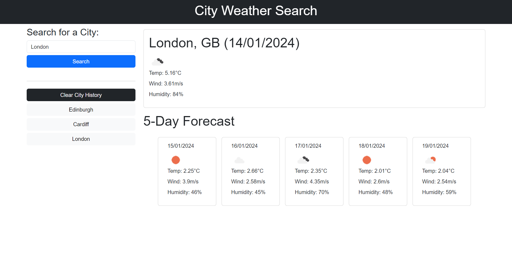

# City Weather Search

## Description

The aim of this project was to build a web application, which presents users with the current and future weather conditions of the city that they have searched for.

The current weather conditions should include:

* the date
* the city’s name
* an icon representation of the current weather conditions
* the temperature, wind speed and humidity

The future weather conditions should include a five day forecast, with each day’s forecast covering the same as the above (except for the city's name).

When a user searches for a city, the city should also be added to the search history. When a user subsequently selects the city from the history, they should again be presented with the current and future weather conditions for that city.

The project specified that the application should run in the browser and include dynamically updated `html` and `css`, as well as make use of [Open Weather Map’s 5 Day Forecast API](https://openweathermap.org/forecast5).

## Build

As per the project criteria, the application makes use of [Open Weather Map’s 5 Day Forecast API](https://openweathermap.org/forecast5). It is also calls [Open Weather Map’s Geocoding API](https://openweathermap.org/api/geocoding-api) to work around the issue posed by [Open Weather Map’s built-in geocoder](https://openweathermap.org/forecast5#builtin) now being deprecated.

Whilst a link to jQuery was included in the starter code, the application is built with `vanilla javascript` (allowing the developer to refresh these skills).

The application also makes use of `Day.js` for working with dates, and some of the application’s styling relies upon `Bootstrap`.

The `javascript` file has been commented throughout with pseudocode, breaking the project into tasks, and comments have also been added to explain the functionality of the code.

The `html` and `css` files have been updated, and all changes to the starter code in these files have been noted in the code comments.

## Installation

N/A

## Usage

Users navigate to the webpage via the URL ([City Weather Search](https://code0em.github.io/city-weather-search/)). When on the page, the header displays the application’s title and an aside section includes a search input, a search button and a clear button. Until the user searches for a city, the centre of the page contains a heading (for the five day forecast) and six empty cards.

If the user selects the search button without entering text in the search input, an error message of “Please enter a city” is displayed below the search input.

When the user searches for a city, the empty cards are populated. The first displays the city’s weather forecast for that day; including the city’s name and country, the current date and the weather conditions (i.e. icon, temperature, wind speed and humidity).

The remaining cards display the city’s forecast for the following five days; with each card displaying the day’s date and the weather conditions (as above).

Where applicable, all units are displayed in metric.

Alongside populating the cards, when the user searches for a city, this also generates a new button in the aside section. The button is labelled with the city’s name. (Note: if a button already exists for the city, this step is skipped).

When the user selects one of the above buttons, that city’s forecast (for that day and the following five days) is again displayed in the six cards.

When the user selects the clear button, the above buttons are no longer displayed (and these cities are removed from local storage).

On a resolution of 1400px, and after the user has searched for “Edinburgh”, “Cardiff” and then “London”, the application will display as follows:

## Credits

Credit given to edX (2023) for providing the application’s starter code, as well the reset `css` file. 

Credit also given to Xpert Learning Assistant (2024) which provided an answer to “how to check the text content of all child elements”. The code-block provided in the answer was adapted and used in the build (credit cited in code comments).

MDN Web Docs’ (2023) and W3Schools’ pages also built upon the developer’s existing knowledge of the methods used throughout the build (credits cited in code comments).

All credits referenced below.

## Licence

Distributed under the MIT License. See `LICENSE.txt` for more information.

## Acknowledgments

Code written by Code0Em ([email](mailto:code.em@outlook.com)/ [GitHub](https://github.com/Code0Em)).

## References

edX (2023) [*Build new skills. Advance your career*](https://www.edx.org/).

edX (2023) *Skillsbootcamp in Front End Web Dev*. Module 2: Lesson 03: Activity 07.

MDN Web Docs (2023) [*The Thematic Break (Horizontal Rule) Element*](https://developer.mozilla.org/en-US/docs/Web/HTML/Element/hr).

W3Schools (no date) [*JavaScript Promises*](https://www.w3schools.com/js/js_promise.asp).

Xpert Learning Assistant (2024) (accessed via Virtual Learning Environment).

